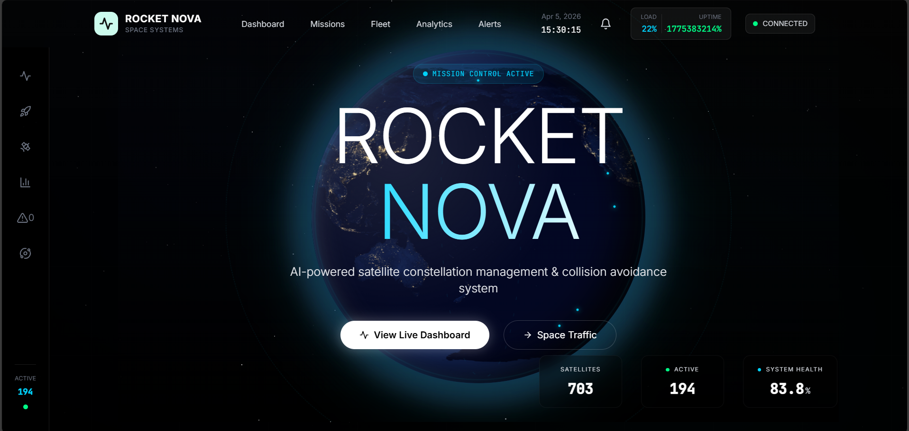
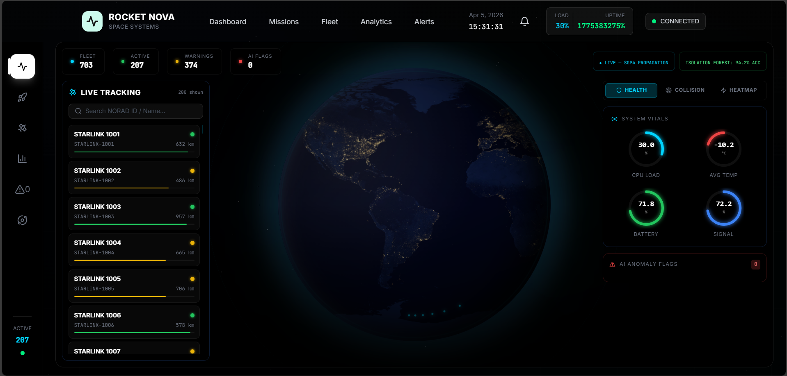
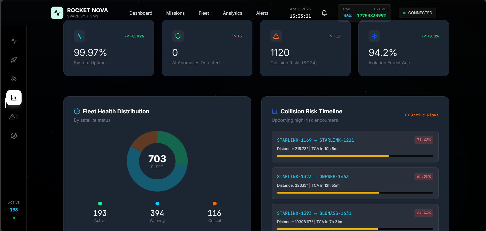
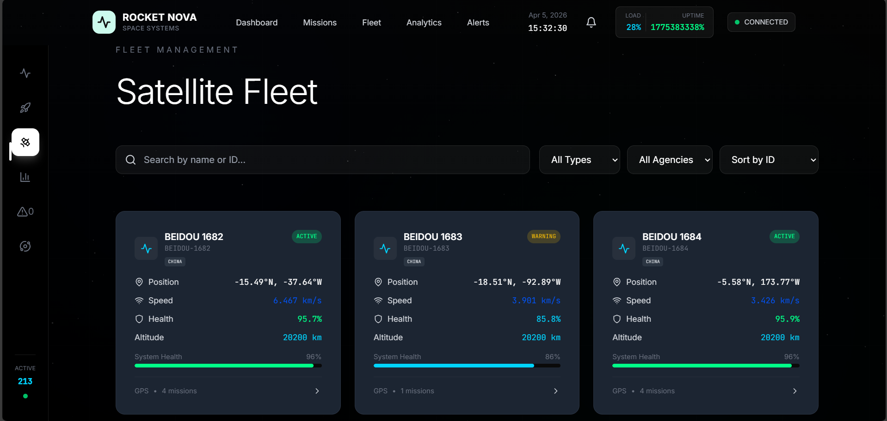

# 🚀 ROCKET NOVA

### AI for Real-Time Satellite Health Monitoring & Collision Prevention

<p align="center">
  
  
  
  
</p>

---

## 📌 Overview

ROCKET NOVA is an AI-powered system designed for real-time satellite health monitoring and collision prevention. It integrates machine learning (Isolation Forest) with orbital prediction (SGP4) to detect anomalies, predict risks, and enhance space mission safety through intelligent decision support.

---

## ✨ Key Features

* 🛰️ Real-time satellite health monitoring
* 🤖 Anomaly detection using Isolation Forest
* 📡 Orbital prediction using SGP4
* ⚠️ Collision risk detection & alert system
* 📊 Interactive dashboard visualization
* 🔄 Scalable and modular architecture

---

## 🛠️ Tech Stack

| Category | Technologies                        |
| -------- | ----------------------------------- |
| Backend  | Python, Scikit-learn, NumPy, Pandas |
| Frontend | React.js, HTML, CSS, JavaScript     |
| Core     | SGP4, Machine Learning              |

---

## 📂 Project Structure

```bash id="5q3lfp"
ROCKET-NOVA/
├── backend/
├── src/
├── public/
├── models/
├── images/
├── README.md
├── package.json
```

---

## 🚀 Getting Started

### Clone the repository

```bash id="s3gl2x"
git clone https://github.com/HarshithTS09/ROCKET-NOVA-AI-for-real-time-satellite-health-monitoring-and-collision-prevention.git
cd ROCKET-NOVA-AI-for-real-time-satellite-health-monitoring-and-collision-prevention
```

### Install dependencies

```bash id="f0q1nr"
pip install -r requirements.txt
npm install
```

### Run the project

```bash id="8hhlp3"
# Backend
python app.py

# Frontend
npm run dev
```

---

## 📸 Screenshots

### 🚀 UI Overview

<p align="center">
  
</p>

### 🛰️ Dashboard

<p align="center">
  
</p>

### 📊 Analytics

<p align="center">
  
</p>

### 🛰️ Fleet Management

<p align="center">
  
</p>

### 📄 Telemetry Report

<p align="center">
  
</p>

### 📈 Graph Insights

<p align="center">
  
</p>

---

## 🎯 Use Cases

* Satellite health monitoring
* Collision prevention
* Space traffic analysis
* Aerospace analytics
* AI anomaly detection

---

## 🌟 Future Enhancements

* Real-time satellite data integration
* Cloud deployment (AWS / Firebase)
* Live satellite tracking
* Advanced deep learning models

---

## 🤝 Contribution

Contributions are welcome! Feel free to fork this repository and submit pull requests.

---

## 📄 License

This project is licensed under the MIT License.

---

## 👨‍💻 Author

**Harshith T S**
🔗 https://github.com/HarshithTS09

---

## ⭐ Support

If you like this project, give it a ⭐ on GitHub!
